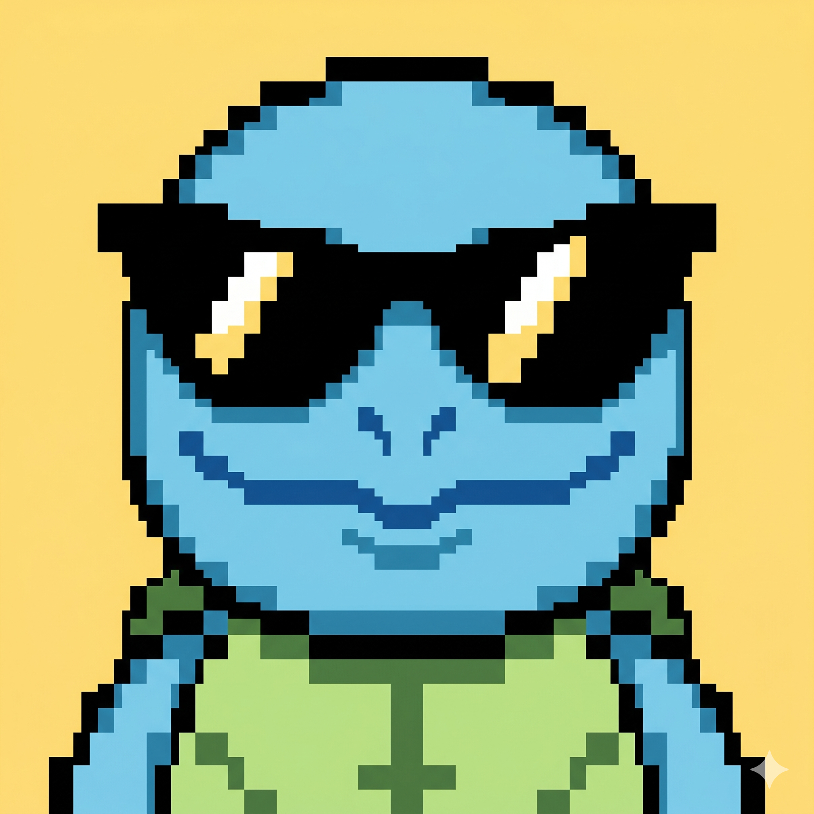
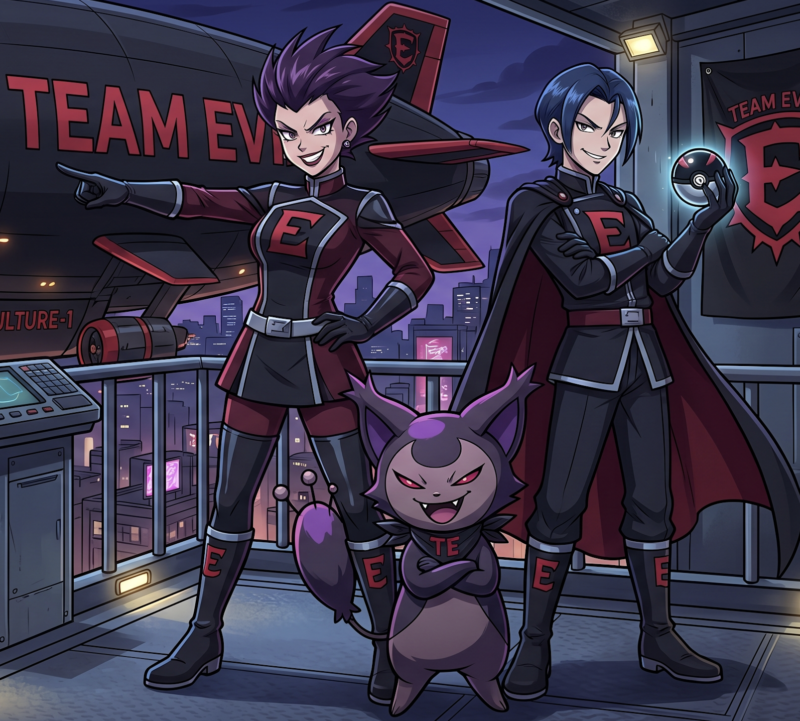

# Project Yellow Olive

**Pokémon Yellow, but you tame Kubernetes clusters instead of Pokémon.**

A terminal-native retro adventure designed to make infrastructure learning feel fun, nostalgic, and a little less overwhelming.

[](https://github.com/Anubhav9/Yellow-Olive)
[](https://opensource.org/licenses/MIT)
[](https://github.com/Anubhav9/Yellow-Olive/actions/workflows/pypi-smoke.yml)
[](https://pepy.tech/project/yellow-olive)
[](https://github.com/Anubhav9/Yellow-Olive)
[](https://github.com/Anubhav9/Yellow-Olive)

If Yellow Olive helps you learn or stay motivated, a [star on GitHub](https://github.com/Anubhav9/Yellow-Olive) goes a long way - it helps more people find the project.


📖 Interested in the technicalities - architecture, contributing, troubleshooting, and local development? Find your way here → [Technical Documentation](https://anubhav9.github.io/Yellow-Olive/)

---

## Try it

**Prerequisites:** Python 3.10+, Docker, [Minikube](https://minikube.sigs.k8s.io/docs/start/), and [kubectl](https://kubernetes.io/docs/tasks/tools/).

```bash
pip install yellow-olive
yellow-olive start
```

The first time you begin a mission, the game spins up a local Minikube cluster - this can take up to a minute.

**Tip:** keep two terminal tabs open - one for the game, one as your **Command Chamber** for `kubectl` commands.

Running from source or need setup help? See the [documentation](https://anubhav9.github.io/Yellow-Olive/).

---

## The Motivation

```
Kubernetes is powerful...
Kubernetes is everywhere...
Kubernetes runs the modern world...
And yet, for many of us, learning it feels confusing, overwhelming, and sometimes just plain boring :(
```

Project Yellow Olive is my personal, experimental attempt at changing that.

I grew up on a GameBoy, lost in the world of Pokémon. Even today, a single chiptune note takes me straight back to those golden childhood days. I know I'm not alone in that feeling.

Nostalgia has a strange power - it lowers resistance, sparks curiosity, and makes difficult things feel lighter.

Yellow Olive is built on that belief: combine nostalgia with motivation, and even something as complex as Kubernetes can become approachable.

---

## An Honest Take

I've attempted the CKAD and CKA certifications - and I didn't clear them.

Not because I didn't understand the concepts, but because I didn't practice enough. Platforms like Killer.sh demand consistency and repetition - and like many of us, I underestimated that discipline.

This project isn't a replacement for serious exam prep.

It's a practice ground - a way to build confidence, stay engaged, and keep the adrenaline slightly elevated while solving real problems.

Not every day is productive. Not every day is high-energy.

This is just my attempt to make the hard days a little easier to push through.

---

## Meet the Characters

### Professor Bald Uncle

<p align="center">
  
</p>

```
The classic mentor archetype. Calm, experienced, slightly intimidating at first glance.

He steps in when you're stuck, nudges you in the right direction, and reminds you that debugging is part of the journey.

Strict on the outside, generous at heart.
```

### Electromon

<p align="center">
  
</p>

```
Your closest companion. Quiet by nature, but restless at heart - he doesn't like being confined for long.

When something feels off in the cluster, he's usually at the center of it. Shy, but loyal through every broken deployment.
```

### PsyQuack

<p align="center">
  
</p>

```
He doesn't talk much. He watches.
You think you fixed the Deployment? He checks.
You're confident the Service works? He verifies.
If something's still off, PsyQuack will let you know - in his own slightly unhinged way.
He doesn't reward effort. He rewards correctness.
```

### Cool Turtle

<p align="center">
  
</p>

```
A wandering engineer who shows up wherever the cluster needs steady hands.

Calm under pressure, stubborn about uptime, and always trying to keep the signal alive
long enough for someone else to finish the fix.

You'll meet him again - different towns, same problem: something critical stopped reaching
where it was supposed to go.
```

### Team Evil

<p align="center">
  
</p>

```
The recurring troublemakers of the Yellow Olive world.

They rarely smash workloads directly - they break the paths between them: routing, naming,
visibility, the quiet plumbing that makes a cluster feel like one system.

Wherever infrastructure should connect, Team Evil has probably been there first.
```

### Master Hana

<p align="center">
  
</p>

```
Harbour Master of Sakura Blossom Village during hanami festival week.

She keeps the gates, piers, and customs lanes staffed when trainers arrive from every region.
Calm, kind, and tired only when the roster says one PokePod and the line says a hundred.
```

---

## From Yellow Olive to Kubernetes

Every character, keyword, and challenge maps directly to a real Kubernetes concept.

| Yellow Olive Concept | Kubernetes Equivalent | What It Means in Practice                          |
| -------------------- | --------------------- | -------------------------------------------------- |
| Posemon              | Container             | A single runnable unit inside a workload           |
| Pokepod              | Pod                   | The smallest deployable unit - houses Posemons     |
| Harbour Roster       | Deployment            | Keeps the right number of PokePods on duty at a post |
| Region / Town        | Namespace             | A bounded district in the cluster - separate scope for resources |

(And many more - every mechanic is built to teach something real.)

---

## Gameplay Commands

- `psyquack validate` - PsyQuack checks your cluster fix for the current challenge.
- `psyquack hint` - A nudge from Professor Bald (without spoiling the answer).
- `psyquack back` - Return to the previous screen.

---

## See it in Action

**Full gameplay walkthrough (2 min):** [Watch on YouTube](https://youtu.be/vAu4aaM1oOw)

---

## Contributing

Contributions are welcome - especially new challenges and scenarios.

Open an issue with your idea, then follow the [contributing guide](https://anubhav9.github.io/Yellow-Olive/contributing/) in the documentation.

---

## Roadmap

Save/load progress and PyPI packaging are live.

| Arc | Region | Kubernetes focus |
| --- | ------ | ---------------- |
| Oakwood Meadows | Challenges 1–7 | Pods |
| Signal Town | Challenges 8–13 | Services, DNS, Ingress |
| Gold Rush City | Challenges 14–19 | RBAC |
| Sakura Harbour | Challenges 20–24 | Deployments (scale, rollouts, canary) |

Sakura Harbour is the newest arc - a hanami festival harbour where you staff gates and lanes with Deployment rosters. Challenge 25 (blue-green / rollback) is still to come.

Full roadmap → [documentation](https://anubhav9.github.io/Yellow-Olive/roadmap/)

---

## Music Credits

Music is sourced from [OpenGameArt](https://opengameart.org/). Licenses vary by track - see the table below. Attribution is required for CC-BY tracks.

| Music File | Track Name | Author | License |
| ---------- | ---------- | ------ | ------- |
| `screen_1_opening_song.mp3` | JRPG Piano | [Joth](https://opengameart.org/users/joth) | CC0 |
| `screen_2_music.mp3` | Town Theme RPG | [Joth](https://opengameart.org/users/joth) | CC0 |
| `battle_music.ogg` | 8 bit RPG Battle Encounter Theme | [Ted Kerr](https://opengameart.org/users/wolfgang) | CC0 |
| `battle_music_2.mp3` | 8 bit Chiptune Encounter Theme | [Shiru8Bit](https://opengameart.org/users/shiru8bit) | CC0 |
| `win_music.ogg` | Win Jingle | [Fupi](https://opengameart.org/users/fupi) | CC0 |
| `loose_music.ogg` | Lost Game Short Music Clip | [Robin Lamb](https://opengameart.org/users/robin-lamb) | CC0 |
| `signal_town_intro_music.mp3` | Abandoned | [Preston Peak](https://opengameart.org/users/ppeak) | CC0 |
| `cool_turtle_intro_music.mp3` | Fated Encounter | [Preston Peak](https://opengameart.org/users/ppeak) | CC0 |
| `team_evil_intro_music.mp3` | Boneyard | [Preston Peak](https://opengameart.org/users/ppeak) | CC0 |
| `gold_rush_city_intro_music.ogg` | Dacoit ~ Desert Theme | [Spring](https://opengameart.org/users/spring) | CC-BY 3.0 |
| `walk_to_vault.ogg` | Lasso Lady | [congusbongus](https://opengameart.org/users/congusbongus) | CC0 |
| `sakura_harbour_intro.mp3` | Enchanted Festival | [Matthew Pablo](https://opengameart.org/users/matthewpablo) | CC-BY 3.0 ([attribution](https://www.matthewpablo.com/services)) |
| `hana_intro.wav` | Town Theme 3 | [LarsG](https://opengameart.org/users/larsg) | CC-BY 3.0 |
| `sakura_harbour_prologue_end.ogg` | Flowerbed Fields [Loop] | [Zane Little Music](https://opengameart.org/users/zane-little-music) | CC-BY 3.0 |

---

## License

MIT - see [LICENSE](LICENSE) for details.
