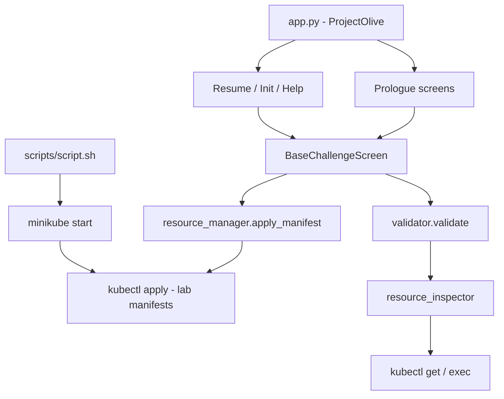

# Architecture

Yellow Olive separates **story content** (under `scenarios/`) from **shared UI and infrastructure** (under `screens/` and `services/`). Each challenge is a self-contained folder with its own screen, text, validator, and Kubernetes manifests.

## System diagram



## Entry point

`app.py` defines:

- `ProjectOlive` - Textual app with main menu (Start, Help, About, Quit)
- `main()` - ensures lab workspace, then runs the app
- `cli()` - `yellow-olive start` entry point registered in `pyproject.toml`

On quit, `on_unmount()` calls `general_utils.teardown_core_infra()` to delete the Minikube profile.

## Challenge loading

`utils/general_utils.py` maps challenge IDs to scenarios:

```python
CHALLENGE_SCENARIO_MAP = {
    "1".."7": "oakwood_meadows",
    "8".."13": "signal_town",
}
```

`load_challenge(challenge_id)` dynamically imports:

```
scenarios.<scenario>.challenge_<id>.screen.Challenge<id>
```

Each challenge screen subclasses `BaseChallengeScreen` and sets:

- `challenge_id`
- `challenge_scenario`
- `challenge_text`

## Base challenge screen

`screens/common/base_challenge_screen.py` owns the shared challenge UX:

| Hook / method | Responsibility |
|---------------|----------------|
| `compose()` | Challenge label, status, input, RichLog |
| `on_mount()` | Save progress, render panel, call `create_resources_for_challenge()` |
| `create_resources_for_challenge()` | **Override** - apply manifests via `resource_manager` |
| `run_validation()` | Import and call `scenarios.<scenario>.challenge_<id>.validator.validate()` |
| `handle_validation()` | Accept only `psyquack validate`, show pass/fail, advance progress |

Progress is written to `yellow-olive-lab/progress.json` on every challenge mount.

## Services layer

### resource_manager.py (writes)

- `iterate_resources()` - list YAML files from the **lab workspace** for a challenge
- `apply_manifest()` - `kubectl apply -f` each lab manifest
- `apply_prologue_resources()` - apply namespace and other prologue infra from **repo source** (not lab)

Prologue manifests live under `scenarios/<scenario>/prologue/k8s_resources/` and are managed by the game, not edited by the player.

### resource_inspector.py (reads)

Read-only kubectl wrappers returning `(ok: bool, payload)`:

- `get_pod`, `get_pods`
- `get_service`, `get_services`
- `get_endpoints`
- `get_ingress`, `get_ingresses`
- `exec_in_pod`

Validators use early-return checks against these payloads.

## Screens organisation

```
screens/
├── common/                 # Cross-scenario UI
│   ├── base_challenge_screen.py
│   ├── game_initialisation_and_reference_screen.py
│   ├── resume_game_screen.py
│   ├── challenge_music_preference_screen.py
│   ├── psy_quack_success_screen.py
│   ├── psy_quack_failure_screen.py
│   └── help_screen.py
└── dialouges/              # Shared dialogue text modules

scenarios/<scenario>/prologue/
├── screens/                # Scenario-specific intro screens
└── dialogues/              # Scenario-specific dialogue text
```

Prologue screens for Oakwood Meadows live under `scenarios/oakwood_meadows/prologue/`. Signal Town intros (Signal Town, Cool Turtle, Team Evil) live under `scenarios/signal_town/prologue/`.

## Progress and save game

`progress.json` fields:

| Field | Purpose |
|-------|---------|
| `player_name` | Shown in Signal Town dialogue |
| `active_challenge_id` | Resume point |
| `challenge_background_music` | `true`, `false`, or unset before first choice |
| `story_intro_act` | Tracks Signal Town intro sequence between challenges 7 and 8 |

`ResumeGameScreen` reloads the appropriate challenge or story intro based on saved progress.

## Constants

`challenge_files/challenge_constants.py` holds pod names, service names, namespaces, and ports referenced by validators. This file is shared across all 13 challenges today. A future refactor may move constants closer to each scenario.

Namespaces:

- `oakwood-meadows` - challenges 1-7
- `signal-town` - challenges 8-13 (plus cross-namespace cases in later challenges)

## Media

`media/background_music_utility.py` plays challenge and intro music from `media/resources/music_files/`. Character art for ASCII rendering lives in `media/resources/image_files/`.

## Related pages

- [Scenarios](scenarios.md) - per-arc folder conventions
- [Validation](validation.md) - how validators are structured
- [Cluster Lifecycle](cluster-lifecycle.md) - when Minikube and namespaces start
