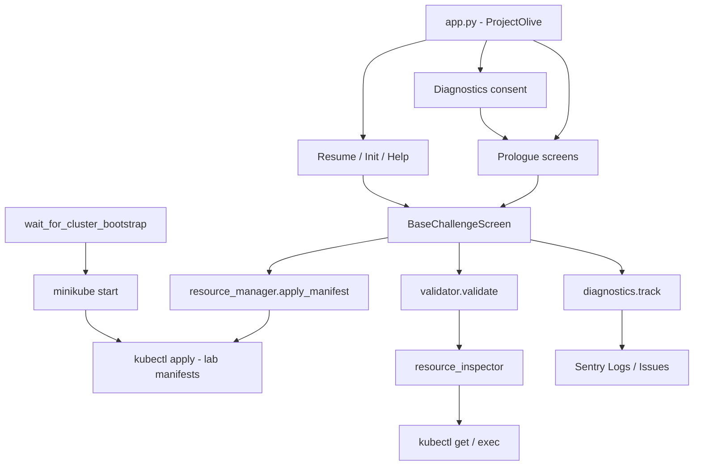

# Architecture

Yellow Olive separates **story content** (under `scenarios/`) from **shared UI and infrastructure** (under `screens/` and `services/`). Each challenge is a self-contained folder with its own screen, text, validator, and Kubernetes manifests.

## System diagram



## Entry point

`app.py` defines:

- `ProjectOlive` - Textual app with main menu (Start, Help, About, Quit)
- `main()` - ensures lab workspace, calls `init_diagnostics()`, then runs the app
- `cli()` - `yellow-olive start` entry point registered in `pyproject.toml`

On first **Start Game**, if diagnostics consent is still `unknown`, `DiagnosticsConsentScreen` is shown before the prologue or resume flow.

On quit, `on_unmount()` stops music, tears down Minikube, and calls `shutdown_diagnostics()`.

## Challenge loading

`utils/general_utils.py` maps challenge IDs to scenarios:

```python
CHALLENGE_SCENARIO_MAP = {
    "1".."7": "oakwood_meadows",
    "8".."13": "signal_town",
    "14".."19": "gold_rush_city",
    "20".."24": "sakura_harbour",
}
```

`load_challenge(challenge_id)` dynamically imports:

```
scenarios.<scenario>.challenge_<id>.screen.Challenge<id>
```

Each challenge screen subclasses `BaseChallengeScreen` and sets:

- `challenge_id`
- `challenge_scenario`
- `challenge_text`

## Base challenge screen

`screens/common/base_challenge_screen.py` owns the shared challenge UX:

| Hook / method | Responsibility |
|---------------|----------------|
| `compose()` | Challenge label, status, input, RichLog |
| `on_mount()` | Save progress, `track("challenge_started")`, render panel, apply manifests |
| `create_resources_for_challenge()` | **Override** - apply manifests via `resource_manager` |
| `run_validation()` | Import and call `scenarios.<scenario>.challenge_<id>.validator.validate()` |
| `handle_validation()` | Accept only `psyquack validate`, `track` pass/fail, advance progress |

Progress is written to `yellow-olive-lab/progress.json` on every challenge mount.

## Services layer

### resource_manager.py (writes)

- `iterate_resources()` - list YAML files from the **lab workspace** for a challenge
- `apply_manifest()` - `kubectl apply -f` each lab manifest
- `apply_prologue_resources()` - apply namespace and other prologue infra from **repo source** (not lab)

Prologue manifests live under `scenarios/<scenario>/prologue/k8s_resources/` and are managed by the game, not edited by the player.

### resource_inspector.py (reads)

Read-only kubectl wrappers returning `(ok: bool, payload)`:

- `get_pod`, `get_pods`
- `get_service`, `get_services`
- `get_endpoints`
- `get_ingress`, `get_ingresses`
- `exec_in_pod`

Validators use early-return checks against these payloads.

### diagnostics (opt-in telemetry)

`services/diagnostics/` is the only module that talks to Sentry.

| API | Purpose |
|-----|---------|
| `init_diagnostics()` | New `session_id`; init Sentry if opted in |
| `track(event, **data)` | Gameplay events → Sentry Logs |
| `track_exception(exc, **data)` | Errors → Sentry Issues |
| `shutdown_diagnostics()` | Flush before exit |
| `grant_consent()` / `decline_consent()` | Consent screen wiring |

Hook points today:

- `app.py` — `game_started`, `game_quit`, consent gate
- `base_challenge_screen.py` — `challenge_started`, `challenge_completed`, `challenge_failed`
- `general_utils.wait_for_cluster_bootstrap()` — `infra_setup_*`
- `general_utils.update_progress()` — `section_completed` on story transitions
- `challenge_music_preference_screen.py` — `music_preference_set`

See [Privacy and Diagnostics](privacy.md) for the full event list and data policy.

## Screens organisation

```
screens/
├── common/                 # Cross-scenario UI
│   ├── base_challenge_screen.py
│   ├── diagnostics_consent_screen.py
│   ├── game_initialisation_and_reference_screen.py
│   ├── resume_game_screen.py
│   ├── challenge_music_preference_screen.py
│   ├── psy_quack_success_screen.py
│   ├── psy_quack_failure_screen.py
│   └── help_screen.py
└── dialouges/              # Shared dialogue text modules

scenarios/<scenario>/prologue/
├── screens/                # Scenario-specific intro screens
└── dialogues/              # Scenario-specific dialogue text
```

Each scenario owns its prologue screens under `scenarios/<scenario>/prologue/screens/`.

## Progress and save game

`progress.json` fields:

| Field | Purpose |
|-------|---------|
| `player_name` | Shown in dialogue |
| `active_challenge_id` | Resume point |
| `challenge_background_music` | `true`, `false`, or unset before first choice |
| `story_intro_act` | Next story intro to play between arcs (integer acts 1–10, or `"done"`) |
| `pending_epilogue` | Optional arc victory screen on resume (`oakwood_meadows`, `signal_town`, `gold_rush_city`) |

`settings.json` (separate file) stores diagnostics consent — see [Lab Workspace](lab-workspace.md).

`ResumeGameScreen` reloads the appropriate challenge, story intro, or epilogue based on saved progress.

## Constants

`challenge_files/challenge_constants.py` holds pod names, service names, namespaces, and ports referenced by validators. This file is shared across challenges. A future refactor may move constants closer to each scenario.

Namespaces:

- `oakwood-meadows` — challenges 1–7
- `signal-town` — challenges 8–13
- `gold-rush-city` — challenges 14–19
- `sakura-harbour` — challenges 20–24

## Media

`media/background_music_utility.py` plays challenge and intro music from `media/resources/music_files/`. Character art for ASCII rendering lives in `media/resources/image_files/`.

## Related pages

- [Scenarios](scenario.md) - per-arc folder conventions
- [Privacy and Diagnostics](privacy.md) - consent and telemetry
- [Validation](validation.md) - how validators are structured
- [Cluster Lifecycle](cluster-lifecycle.md) - when Minikube and namespaces start
