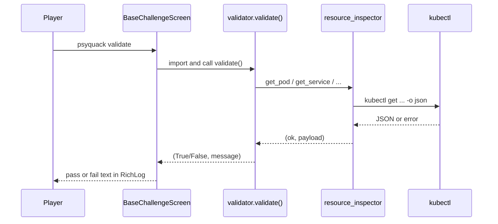

# Validation

PsyQuack validates player fixes by inspecting the **live cluster** through kubectl. Validation logic lives in each challenge's `validator.py`. Shared read helpers live in `services/resource_inspector.py`.

There is no central `challenge_validation.py` module anymore - each challenge owns its rules.

## Flow



## Validator contract

Every validator module exposes:

```python
def validate():
    # early-return checks
    return True, "Success message for the player"
    # or
    return False, "Actionable failure message"
```

Rules:

- Return player-facing strings - use Yellow Olive vocabulary (Pokepod, signal path, etc.) where it fits the challenge
- Use **early returns** - check existence first, then spec fields, then runtime state (ready, endpoints)
- Import constants from `challenge_files.challenge_constants` (or local constants if you add scenario-level shared files later)
- Do not shell out to kubectl directly - use `resource_inspector`

## resource_inspector API

All functions return `(ok: bool, payload)`:

| Function | Success payload | Typical use |
|----------|-----------------|-------------|
| `get_pod(name, namespace)` | Pod dict | Container ready, status |
| `get_pods(namespace, label_selector=None)` | List of pods | Count replicas |
| `get_service(name, namespace)` | Service dict | type, ports, selector |
| `get_services(namespace)` | List of services | Discover names |
| `get_endpoints(name, namespace)` | Endpoints dict | Backend addresses wired |
| `get_ingress(name, namespace)` | Ingress dict | rules, host, class |
| `get_ingresses(namespace)` | List of ingresses | |
| `exec_in_pod(pod, namespace, command)` | stdout string | HTTP checks from inside cluster |

On failure, `payload` is a short error string suitable to show or wrap.

Timeouts default to 5 seconds (15 for exec). Connection timeouts produce friendly messages instead of stack traces.

## Example: Challenge 1 (pod ready)

```python
from challenge_files import challenge_constants
from services import resource_inspector


def validate():
    pod_name = challenge_constants.CHALLENGE_1_POD_NAME
    namespace = challenge_constants.NAMESPACE_OAKWOOD_MEADOWS

    ok, pod = resource_inspector.get_pod(pod_name, namespace)
    if not ok:
        return False, "Pokepod not found. Is Electromon deployed in this namespace?"

    container_statuses = pod.get("status", {}).get("containerStatuses", [])
    if not container_statuses:
        return False, "Electromon's Pokepod has no container status yet. Give it a moment, then try again."

    if container_statuses[0].get("ready") is not True:
        return False, "Electromon's Pokepod is not ready yet. Inspect the manifest and fix the issue."

    return True, "Electromon is out of the Pokepod and ready for adventure."
```

## Example: Challenge 8 (Service + Endpoints)

Service challenges typically verify:

1. Service exists
2. `spec.type` (for example ClusterIP)
3. `spec.selector` matches expected labels
4. Port and targetPort
5. Endpoints object has ready addresses

See `scenarios/signal_town/challenge_8/validator.py` for the full pattern.

## Wiring from the screen

`BaseChallengeScreen.run_validation()` resolves the scenario from `self.challenge_scenario` and imports:

```
scenarios.<scenario>.challenge_<id>.validator
```

If a screen forgets to set `challenge_scenario`, validation raises a clear runtime error.

## Constants

Shared names and namespaces live in `challenge_files/challenge_constants.py`:

```python
NAMESPACE_OAKWOOD_MEADOWS = "oakwood-meadows"
NAMESPACE_SIGNAL_TOWN = "signal-town"
CHALLENGE_1_POD_NAME = "electromon-pod"
# ...
```

When adding a challenge, add constants here if multiple files need the same resource name.

## Testing validators locally

1. Start the game and enter the challenge (manifests apply automatically).
2. Fix the cluster from your Command Chamber.
3. Optionally run validation in a Python shell:

```python
from scenarios.oakwood_meadows.challenge_1.validator import validate
print(validate())
```

4. Type `psyquack validate` in the game for the full UX path.

## Message guidelines

- **Fail messages** should hint at what is wrong without giving the exact YAML edit
- **Pass messages** can celebrate in character
- Prefer one failure at a time - first check that fails wins

## Related pages

- [Contributing: Adding a Challenge](contributing/adding-a-challenge.md) - step-by-step for new validators
- [Architecture](architecture.md) - where validation sits in the screen lifecycle
- [Lab Workspace](lab-workspace.md) - validators check cluster state, not lab files on disk
